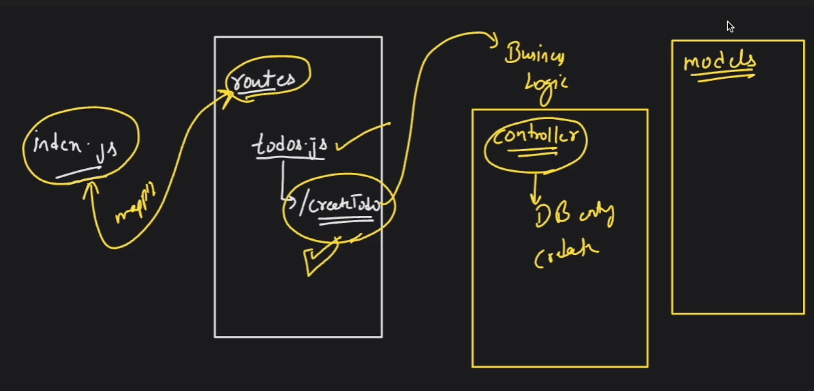

#Routes -> It is a folder which contains all the routes of the site.
example:- a file of todos.js inside the Routes folder. And there is a route inside the the todos.js file
like "/createTodo".

Now the "/createTodo" is mapped with business logic. The business logic is in the folder "Controller".
example below

Model -> it contains the properties.
example -> color of car, car weight , car age . These all are the properties of car so they are in the Model folder.
example -> Engine will be in the controller. Controller contain the logic. Or we can say that the operations

config -> The code for the mongoose , which is used for the connection of database to the application. 

".env" -> we define the portnumber in this . The URL of the database will also here.